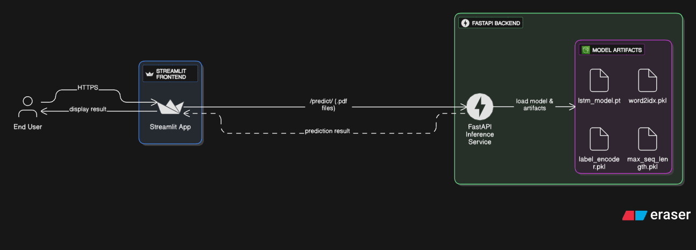

# Resume Classifier Application

This project is a Resume Classifier that utilizes a trained LSTM model to categorize resumes based on their content. The application consists of a FastAPI backend for model inference and a Streamlit frontend for user interaction.

## Project Structure

```
resume-classification
├── main.py                  # FastAPI backend
├── train_model.py           # Model training and export script
├── model/                   # Model artifacts directory
│   ├── lstm_classifier.pth  # Trained LSTM model weights
│   ├── word2idx.pkl         # Vocabulary mapping (word to index)
│   ├── label_encoder.pkl    # Label encoder for categories
│   └── max_seq_length.pkl   # Maximum sequence length used in training
├── pdf_to_resume.csv        # Preprocessed resume data (optional)
├── requirements.txt         # Python dependencies
├── frontend/
│   └── streamlit_app.py     # Streamlit frontend app
└── README.md                # Project documentation
```

## Setup Instructions

### 1. Install Dependencies

Install all required Python packages:

```bash
pip install -r requirements.txt
```

### 2. Train the Model (Optional)

If you want to train your own model, run:

```bash
python train_model.py
```

This will generate the model artifacts in the `model/` directory.

### 3. Start the FastAPI Backend

```bash
uvicorn main:app --reload
```

The backend will be available at `http://localhost:8000`.

### 4. Start the Streamlit Frontend

```bash
cd frontend
streamlit run streamlit_app.py
```

The frontend will be available at `http://localhost:8000`.

## API Usage

### File Upload Endpoint (used by Streamlit frontend)

- **POST** `/predict/`
- **Request:** `multipart/form-data` with a PDF file (key: `file`)
- **Response:** `{ "predicted_category": "CategoryName" }`

Example using `curl`:

```bash
curl -X POST "http://localhost:8000/predict/" -F "file=@your_resume.pdf"
```

### Text Endpoint (for direct text prediction)

- **POST** `/predict` (if enabled)
- **Request:** JSON `{ "text": "Resume text here" }`
- **Response:** `{ "category": "CategoryName" }`

## Model Artifacts

The backend requires the following files in the `model/` directory:

- `lstm_classifier.pth`
- `word2idx.pkl`
- `label_encoder.pkl`
- `max_seq_length.pkl`

These are generated by `train_model.py` after training.

## System Architecture


## Acknowledgments

This project uses FastAPI, Streamlit, PyTorch, NLTK, and other open-source libraries for natural language processing and web development.